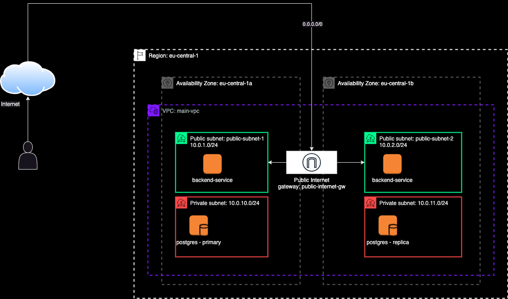

# Hello!

## What does this project do?

From backend to DevOps engineering, from Java to Terraform. Using AWS as cloud provider and Github Actions as CI/CD tool.

Following you can find an overview of the architecture of the project. To get to know more about the technical details, please refer to the technical documentation.

## Technical documentation

The technical documentation and guides are written using Writerside. If you want to know more you can access this [link](https://sheyko94.github.io/kubernetes_terraform/).

